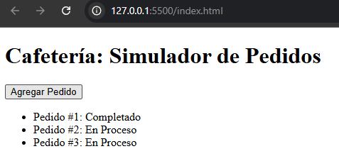

# ☕ Simulador de Pedidos en una Cafetería

Este proyecto simula el funcionamiento de una cafetería moderna, donde los pedidos se reciben, procesan y completan de forma asincrónica utilizando JavaScript y el Event Loop.

## 🧩 Funcionalidades

- Recibir nuevos pedidos con un identificador único.
- Mostrar los pedidos en una lista con su estado actual.
- Simular el tiempo de preparación de cada pedido.
- Actualizar el estado de los pedidos de "En Proceso" a "Completado".
- Manejo asincrónico con `setTimeout`, `Promise` y `async/await`.

## 🚀 Tecnologías Utilizadas

- HTML5
- JavaScript ES6+

## 🗂 Estructura del Proyecto
/cafeteria-simulador
│
├── index.html # Interfaz de usuario
├── app.js # Lógica principal de la simulación
└── README.md # Documentación del proyecto
## 📦 Cómo Ejecutar el Proyecto

1. Clona este repositorio o descarga los archivos.
2. Abre el archivo `index.html` en tu navegador.
3. Haz clic en el botón **"Agregar Pedido"** para generar un nuevo pedido.
4. Observa cómo el pedido aparece en la lista y cambia de estado después de unos segundos.

## 📸 Captura de Pantalla (opcional)

_Si deseas agregar una imagen, guárdala en el repositorio y usa algo como:_

```md
